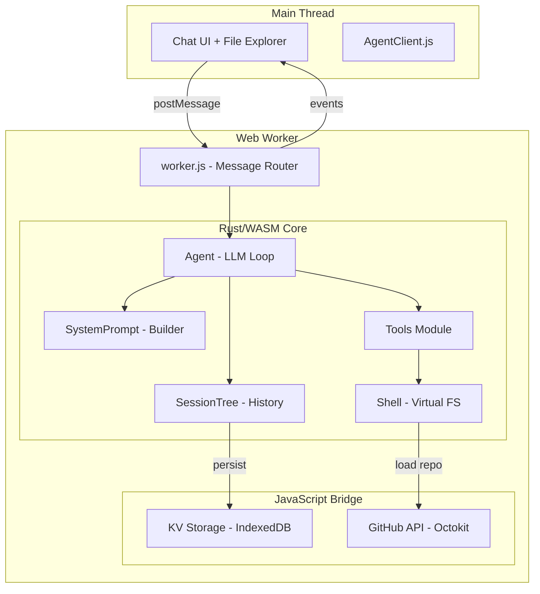
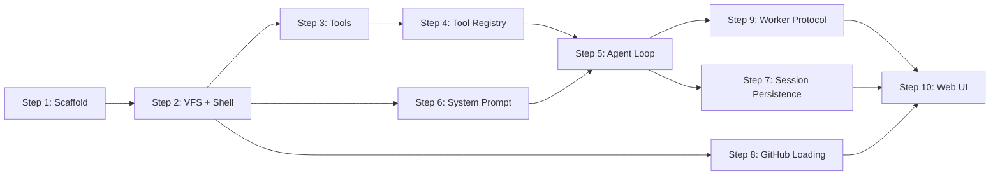

# Plan: 09-integrated-agent — Browser Coding Agent

## Goal

Create `09-integrated-agent/` — a single project that wires together building blocks 02-08 into a functional browser coding agent. The agent loads a GitHub repository into a virtual filesystem, accepts user prompts, calls an LLM, executes tools (read, write, edit, bash, grep, find), persists sessions, and supports branching.

## Architecture



## Project Structure

```
09-integrated-agent/
├── Cargo.toml
├── build.sh
├── README.md
├── src/
│   ├── lib.rs              # WASM entry: CodingAgent struct
│   ├── agent.rs            # Agent loop: chat, run_step, tool dispatch
│   ├── llm.rs              # Gemini API client (from 06)
│   ├── session.rs          # SessionTree with persistence hooks (from 07)
│   ├── models.rs           # Shared types: SessionEntry, AgentStep, etc.
│   ├── shell.rs            # Shell commands (from 08)
│   ├── fs.rs               # VirtualFileSystem (from 08)
│   ├── tools/
│   │   ├── mod.rs          # Tool registry and dispatch
│   │   ├── read.rs         # read tool: file reading with offset/limit
│   │   ├── write.rs        # write tool: file creation/overwrite
│   │   ├── edit.rs         # edit tool: surgical find-and-replace (NEW)
│   │   ├── bash.rs         # bash tool: virtual shell execution
│   │   ├── grep.rs         # grep tool: content search (NEW)
│   │   └── find.rs         # find tool: glob file discovery (NEW)
│   ├── prompt.rs           # System prompt construction
│   └── truncate.rs         # Output truncation utilities (NEW)
└── web/
    ├── index.html           # Unified UI: chat + file tree + terminal
    ├── index.js             # UI controller
    ├── agent-client.js      # Promise-based agent API
    ├── kv-storage.js        # IndexedDB wrapper (from 03)
    ├── github-loader.js     # Octokit repo loading (from 04/08)
    ├── worker.js            # Web Worker message router
    └── style.css
```

## Implementation Steps

### Step 1: Scaffold the Rust Crate

Create `09-integrated-agent/Cargo.toml` combining dependencies from 06, 07, and 08:

```toml
[package]
name = "coding-agent"
version = "0.1.0"
edition = "2021"

[lib]
crate-type = ["cdylib"]

[dependencies]
wasm-bindgen = "0.2"
wasm-bindgen-futures = "0.4"
serde = { version = "1.0", features = ["derive"] }
serde_json = "1.0"
js-sys = "0.3"
uuid = { version = "1.0", features = ["v4", "js"] }
chrono = { version = "0.4", features = ["serde"] }
getrandom = { version = "0.2", features = ["js"] }
serde-wasm-bindgen = "0.6"
web-sys = { version = "0.3", features = [
    "Headers", "Request", "RequestInit", "RequestMode",
    "Response", "WorkerGlobalScope", "console",
] }
```

### Step 2: Port and Integrate Virtual Filesystem + Shell

Copy [`fs.rs`](../08-virtual-shell/src/fs.rs), [`models.rs`](../08-virtual-shell/src/models.rs), and [`shell.rs`](../08-virtual-shell/src/shell.rs) from 08-virtual-shell. The shell becomes the execution environment for all file tools.

**Modifications needed:**
- Add `recursive_mkdir()` to `VirtualFileSystem` — the write tool needs auto-creating parent directories
- Add `find_files()` method — glob-based file search across the tree
- Add `grep_files()` method — regex content search across all files
- Add `get_file_with_lines()` — read with offset/limit support and line numbering
- Make `Shell.fs` accessible for direct tool use (tools bypass shell command parsing)

### Step 3: Implement the Tools Module

Each tool follows the pattern from the TypeScript agent: takes structured parameters, operates on the virtual filesystem, returns a text result.

#### 3a: `read` Tool

Port from [`read.ts`](../coding-agent/core/tools/read.ts). Parameters: `path`, `offset?`, `limit?`.

```rust
pub struct ReadToolParams {
    pub path: String,
    pub offset: Option<usize>,  // 1-indexed line number
    pub limit: Option<usize>,   // max lines
}
```

**Key behaviors:**
- Returns file content with line numbers prepended
- Supports offset/limit for paginated reading of large files
- Truncates at 2000 lines or 50KB (whichever first)
- Returns error for non-existent files

#### 3b: `write` Tool

Port from [`write.ts`](../coding-agent/core/tools/write.ts). Parameters: `path`, `content`.

```rust
pub struct WriteToolParams {
    pub path: String,
    pub content: String,
}
```

**Key behaviors:**
- Creates file and all parent directories automatically
- Overwrites existing files completely
- Returns byte count confirmation

#### 3c: `edit` Tool (NEW — Critical)

Port from [`edit.ts`](../coding-agent/core/tools/edit.ts) and [`edit-diff.ts`](../coding-agent/core/tools/edit-diff.ts). Parameters: `path`, `old_text`, `new_text`.

```rust
pub struct EditToolParams {
    pub path: String,
    pub old_text: String,
    pub new_text: String,
}
```

**Key behaviors to implement:**
1. Read file content
2. **Exact match first** — `content.find(old_text)`
3. **Fuzzy match fallback** — Normalize trailing whitespace, smart quotes → ASCII, Unicode dashes → hyphen, special spaces → regular space
4. **Uniqueness check** — If multiple occurrences found, return error asking for more context
5. **Perform replacement** — `content[..start] + new_text + content[start+match_len..]`
6. **Generate diff** — Unified diff with line numbers for the response
7. Return the diff as the tool result

The fuzzy matching logic from [`edit-diff.ts`](../coding-agent/core/tools/edit-diff.ts:34) translates cleanly to Rust:

```rust
fn normalize_for_fuzzy_match(text: &str) -> String {
    text.lines()
        .map(|line| line.trim_end())
        .collect::<Vec<_>>()
        .join("\n")
        // Smart quotes → ASCII
        .replace(&['\u{2018}', '\u{2019}', '\u{201A}', '\u{201B}'][..], "'")
        .replace(&['\u{201C}', '\u{201D}', '\u{201E}', '\u{201F}'][..], "\"")
        // Unicode dashes → hyphen
        .replace(&['\u{2010}', '\u{2011}', '\u{2012}', '\u{2013}',
                    '\u{2014}', '\u{2015}', '\u{2212}'][..], "-")
        // Special spaces → regular
        .replace('\u{00A0}', " ")
}
```

#### 3d: `bash` Tool

Wraps the virtual shell from 08. Parameters: `command`.

```rust
pub struct BashToolParams {
    pub command: String,
}
```

Executes `Shell::execute(command)` and returns `ShellResult.stdout` or `ShellResult.stderr`.

#### 3e: `grep` Tool (NEW)

In-memory file content search. Parameters: `pattern`, `path?`, `ignore_case?`, `limit?`.

```rust
pub struct GrepToolParams {
    pub pattern: String,
    pub path: Option<String>,
    pub ignore_case: Option<bool>,
    pub limit: Option<usize>,
}
```

**Implementation approach:**
- Walk the `VirtualFileSystem` tree recursively
- For each file, search content line-by-line with the pattern
- Use Rust's `regex` crate for regex support
- Return matches formatted as: `path/to/file.rs:42: matched line content`
- Default limit: 100 matches

Add `regex` to `Cargo.toml`:
```toml
regex = "1.0"
```

#### 3f: `find` Tool (NEW)

Glob-based file discovery. Parameters: `pattern`, `path?`, `limit?`.

```rust
pub struct FindToolParams {
    pub pattern: String,
    pub path: Option<String>,
    pub limit: Option<usize>,
}
```

**Implementation approach:**
- Walk the `VirtualFileSystem` tree recursively collecting all file paths
- Match against the glob pattern using Rust's `glob` pattern matching (or a simple `contains`/`ends_with` for common cases)
- Return matching paths, one per line
- Default limit: 1000 results

Add `glob-match` to `Cargo.toml`:
```toml
glob-match = "0.2"
```

### Step 4: Tool Registry and Dispatch

Create a tool registry that the LLM sees as function declarations and that dispatches calls to the appropriate handler.

```rust
pub struct ToolRegistry {
    tools: Vec<ToolDefinition>,
}

impl ToolRegistry {
    pub fn coding_tools() -> Self {
        ToolRegistry {
            tools: vec![
                read_tool_definition(),
                write_tool_definition(),
                edit_tool_definition(),
                bash_tool_definition(),
            ],
        }
    }

    pub fn all_tools() -> Self {
        let mut registry = Self::coding_tools();
        registry.tools.push(grep_tool_definition());
        registry.tools.push(find_tool_definition());
        registry
    }

    pub fn execute(&self, shell: &mut Shell, name: &str, args: &Value) -> ToolResult {
        match name {
            "read" => execute_read(shell, args),
            "write" => execute_write(shell, args),
            "edit" => execute_edit(shell, args),
            "bash" => execute_bash(shell, args),
            "grep" => execute_grep(shell, args),
            "find" => execute_find(shell, args),
            _ => ToolResult::error(format!("Unknown tool: {}", name)),
        }
    }

    pub fn to_gemini_declarations(&self) -> Vec<FunctionDeclaration> { ... }
}
```

### Step 5: Integrate Agent Loop with Tools

Modify the 06-agent [`Agent`](../06-agent/src/lib.rs:31) struct to own the `Shell` and `ToolRegistry` instead of receiving tool definitions from JavaScript.

```rust
#[wasm_bindgen]
pub struct CodingAgent {
    api_key: String,
    model: String,
    system_prompt: String,
    history: Vec<ChatMessage>,
    shell: Shell,
    tools: ToolRegistry,
    session: SessionTree,
}
```

**Critical change from 06-agent:** Tools now execute inside the WASM worker, not in the JavaScript main thread. This eliminates the round-trip overhead of:
1. Worker → Main (tool_call)
2. Main executes tool
3. Main → Worker (tool_result)

Instead:
1. Agent calls LLM → gets tool_call
2. Agent dispatches to `ToolRegistry::execute()` directly in WASM
3. Agent feeds result back to LLM
4. Only final text responses and progress events go to Main thread

**The `chat()` method now runs the full loop:**

```rust
pub async fn chat(&mut self, user_message: String) -> Result<JsValue, JsValue> {
    // 1. Append user message to session tree + history
    self.session.append_message("user".into(), user_message.clone());
    self.history.push(user_msg);

    // 2. Run the agent loop
    loop {
        let step = self.call_llm().await?;
        
        // Emit step event to JS
        self.emit_event(&step);
        
        match step.type_ {
            "text" => {
                // Final response — append to session and return
                self.session.append_message("assistant".into(), step.content);
                return Ok(step.to_js());
            }
            "tool_call" => {
                // Execute tools locally
                for call in &step.tool_calls {
                    let result = self.tools.execute(&mut self.shell, &call.name, &call.args);
                    
                    // Append tool result to history for next LLM call
                    self.add_tool_result(call.name.clone(), result.to_json());
                    
                    // Emit tool execution event
                    self.emit_tool_event(&call, &result);
                }
                // Loop continues — next LLM call with tool results
            }
            "error" => return Err(step.to_js()),
        }
    }
}
```

### Step 6: System Prompt Construction

Port the system prompt builder from [`system-prompt.ts`](../coding-agent/core/system-prompt.ts). The system prompt tells the LLM what tools are available and how to use them.

```rust
pub fn build_system_prompt(tools: &ToolRegistry, cwd: &str) -> String {
    let tool_list = tools.tools.iter()
        .map(|t| format!("- {}: {}", t.name, t.description))
        .collect::<Vec<_>>()
        .join("\n");

    format!(
        "You are an expert coding assistant. You help users by reading files, \
         editing code, and writing new files.\n\n\
         Available tools:\n{}\n\n\
         Guidelines:\n\
         - Use read to examine files before editing\n\
         - Use edit for precise changes - old text must match exactly\n\
         - Use write only for new files or complete rewrites\n\
         - Be concise in your responses\n\
         - Show file paths clearly when working with files\n\n\
         Current working directory: {}",
        tool_list, cwd
    )
}
```

### Step 7: Session Persistence via IndexedDB

Connect the `SessionTree` to IndexedDB through JavaScript callbacks.

**Rust side** — Add a callback hook for persistence:

```rust
#[wasm_bindgen]
extern "C" {
    #[wasm_bindgen(js_name = "persistSessionEntry")]
    fn persist_session_entry(session_id: &str, entry_json: &str);
}
```

**JavaScript side** — `worker.js` implements the callback:

```javascript
// Called by WASM when a new entry is added
globalThis.persistSessionEntry = (sessionId, entryJson) => {
    // Store to IndexedDB via kv-storage.js
    kvStore.appendToSession(sessionId, entryJson);
};
```

This way, every `append_message()` or `branch()` automatically persists to IndexedDB.

### Step 8: GitHub Repository Loading

**JavaScript side** — `worker.js` loads the GitHub repo using Octokit (same pattern as 08-virtual-shell), then passes the file list to WASM:

```javascript
async function loadRepo(owner, repo) {
    const files = await fetchGitHubTree(owner, repo);
    agent.load_files(JSON.stringify(files));
}
```

**Rust side** — `CodingAgent.load_files()` delegates to `Shell.load_files()`.

### Step 9: Web Worker Message Protocol

The worker.js message router handles:

| Message Type | Direction | Description |
|-------------|-----------|-------------|
| `init` | Main → Worker | Initialize agent with API key, model, repo config |
| `chat` | Main → Worker | Send user message, starts agent loop |
| `branch` | Main → Worker | Jump to a session tree node |
| `get_history` | Main → Worker | Get current branch history |
| `get_tree` | Main → Worker | Get full session tree for visualization |
| `get_fs` | Main → Worker | Get filesystem tree for file explorer |
| `step` | Worker → Main | Agent step event (tool call or text) |
| `tool_exec` | Worker → Main | Tool execution start/end events |
| `done` | Worker → Main | Agent finished with final response |
| `error` | Worker → Main | Error occurred |

### Step 10: Unified Web UI

A single-page application with three panels:

```
┌─────────────────────────────────────────────────────┐
│  [Agent] [Files] [Terminal]              [Settings]  │
├─────────────────────────────────────────────────────┤
│                                                      │
│  ┌──────────────────────┐  ┌──────────────────────┐ │
│  │                      │  │                      │ │
│  │    Chat History      │  │   File Tree /        │ │
│  │    (messages +       │  │   File Viewer        │ │
│  │     tool calls)      │  │                      │ │
│  │                      │  │                      │ │
│  │                      │  │                      │ │
│  ├──────────────────────┤  │                      │ │
│  │ [Type a message...]  │  │                      │ │
│  └──────────────────────┘  └──────────────────────┘ │
│                                                      │
│  ┌──────────────────────────────────────────────────┐│
│  │  Tool Execution Log / Terminal Output             ││
│  └──────────────────────────────────────────────────┘│
└─────────────────────────────────────────────────────┘
```

## Dependency Graph



**Parallelizable work:**
- Steps 3a-3f (individual tools) can be built independently
- Step 6 (system prompt) can be built alongside Step 3
- Step 7 (session persistence) and Step 8 (GitHub loading) are independent
- Step 10 (UI) can start once Step 9 (worker protocol) is defined

## Key Design Decisions

### 1. Tools Execute Inside WASM (not JavaScript)

In 06-agent, tools executed in the JavaScript main thread. For the integrated agent, all tools execute inside the WASM worker. This eliminates the postMessage round-trip per tool call and simplifies the architecture.

**Exception:** GitHub API calls and IndexedDB operations still use JavaScript via imports, since those are browser APIs not available in WASM directly.

### 2. Single Rust Crate (not a Workspace)

Combining all code into one crate keeps the build simple and avoids inter-crate WASM complications. The module structure provides clean separation.

### 3. Session Tree Owns History (Agent References It)

The `SessionTree` is the source of truth for conversation history. The `Agent.history` field that gets sent to the LLM is rebuilt from the session tree's current branch. This ensures branching works correctly — when you `branch()` to a different node, the history sent to the LLM changes automatically.

### 4. Streaming Deferred to Phase 2

For Phase 1, we use `generateContent` (non-streaming). This simplifies the implementation significantly. Streaming (`streamGenerateContent`) can be added in Phase 2 without changing the tool execution architecture.

## Acceptance Criteria

The integrated agent is considered complete when:

- [ ] User can enter a GitHub repo owner/name and it loads into the virtual filesystem
- [ ] User can chat with the agent and receive responses
- [ ] Agent can use `read` to view file contents with line numbers
- [ ] Agent can use `write` to create new files
- [ ] Agent can use `edit` to make surgical find-and-replace edits with fuzzy matching
- [ ] Agent can use `bash` to run shell commands (ls, cd, cat, etc.)
- [ ] Agent can use `grep` to search file contents
- [ ] Agent can use `find` to discover files by pattern
- [ ] Tool execution results are visible in the UI
- [ ] Conversation persists to IndexedDB and survives page reload
- [ ] User can branch the session tree and continue from any point
- [ ] File explorer shows the virtual filesystem state
- [ ] System prompt includes tool descriptions and working directory
