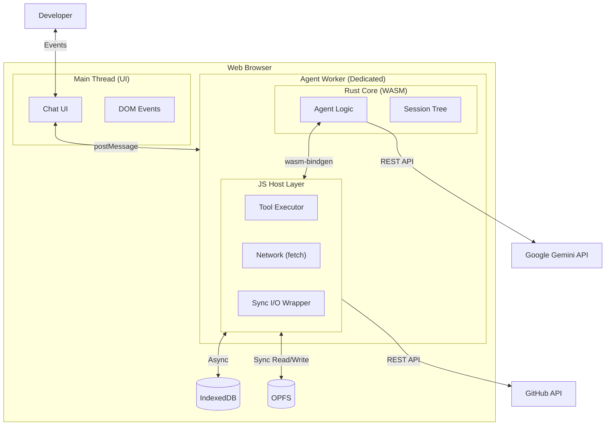
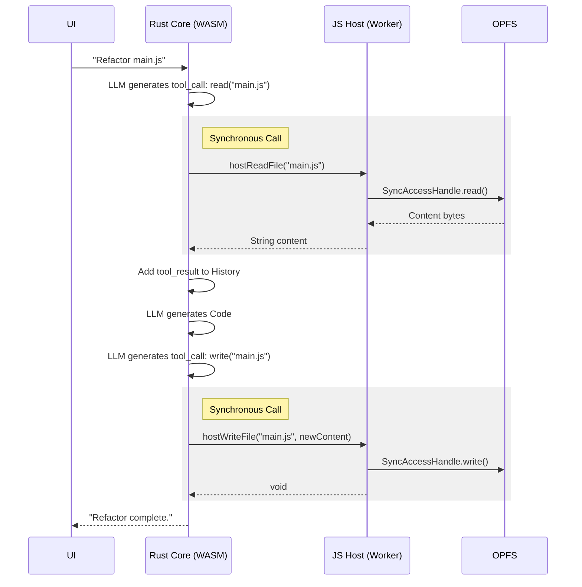

# Architecture: Browser Coding Agent (Rust/WASM + Native Web Standards)

## Overview

A high-performance, browser-native coding agent. The core intelligence resides in a **Rust/WASM module** running inside a **dedicated Web Worker**. It orchestrates file operations, tool execution, and LLM communication.

To minimize latency and complexity, the WASM module interacts with the browser environment (OPFS, Network) via a **JavaScript Host Layer** within the *same worker*. This architecture requires **zero third-party dependencies**, relying exclusively on native Browser APIs.

**Storage Strategy:**
* **OPFS (Sync)**: Repository files and tools. Accessed via `FileSystemSyncAccessHandle` for blocking I/O within the worker.
* **IndexedDB**: Session trees and metadata. Accessed via raw `indexedDB` API.

## Context

The agent enables developers to:
* Load GitHub repositories using the GitHub REST API (no Git library required).
* Chat with an AI assistant that maintains a persistent Rust-based session tree.
* Execute tools instantly without main-thread blocking.
* Create dynamic tools that are compiled/validated by the Rust core but executed by the JS Host Layer.

## Design Philosophy

* **Zero-Dependency**: No `npm install`. Uses `fetch`, `Worker`, `WASM`, and `OPFS` native APIs only.
* **Unified Worker Scope**: Rust (Brain) and JS Tools (Hands) live in the same thread.
* **Synchronous Bridge**: Rust calls JS host functions synchronously for file I/O, simplifying state management.
* **Reliability**: Uses "Full File Rewrite" instead of fuzzy patching to ensure code integrity.

---

## System Context



---

## Container Architecture

### 1. Main Thread (UI Layer)
**Responsibility:** Rendering and User Input only.
* **Role:** Dumb terminal. It forwards text to the Worker and renders the JSON responses.
* **No Logic:** Does not execute tools, does not parse files, does not talk to LLMs.

### 2. Agent Worker (The "Hybrid Engine")
**Responsibility:** Everything else.
* **Rust Core (WASM):**
    * Manages the Context Window (token counting, compaction).
    * Maintains the Session Tree (branching history).
    * Decisions: "Should I call a tool or answer the user?"
* **JS Host Layer:**
    * Acts as the "Operating System" for the WASM core.
    * Exposes functions like `host_read_file`, `host_fetch_url` to Rust.
    * Executes dynamic JavaScript tools using `new Function()` within the worker scope.

### 3. Storage Layer
* **OPFS**: Accessed synchronously. This is critical. It allows Rust to say "Read file X" and get the string back immediately, without needing `Promise` handling logic in Rust.
* **IndexedDB**: Accessed asynchronously for saving session checkpoints.

---

## Component Details

### The Rust/JS Bridge (Synchronous I/O)

The architecture relies on `wasm-bindgen` to import JS functions into Rust.

**Rust Side (Import Definition):**
```rust
#[wasm_bindgen]
extern "C" {
    // Synchronous I/O enabled by OPFS Sync Handles
    #[wasm_bindgen(js_name = "hostReadFile")]
    fn host_read_file(path: &str) -> String;

    #[wasm_bindgen(js_name = "hostWriteFile")]
    fn host_write_file(path: &str, content: &str);

    // Network is async, so Rust handles the Promise
    #[wasm_bindgen(js_name = "hostFetch")]
    async fn host_fetch(url: &str, method: &str, body: Option<String>) -> JsValue;
}
```

**JavaScript Side (Host Implementation inside Worker):**
```javascript
// Within the Worker
let opfsRoot; // Initialized on startup

function hostReadFile(path) {
    // Uses FileSystemSyncAccessHandle
    // logic to open handle, read buffer, decode, close handle
    // Returns string directly
}

function hostWriteFile(path, content) {
    // Uses FileSystemSyncAccessHandle
    // logic to open handle, truncate, write, flush, close
}
```

### GitHub Loader (Zero-Library Strategy)

Instead of using `isomorphic-git` (external lib), we use the GitHub REST API to perform a "shallow load".

1. **List Files:** `GET /repos/{owner}/{repo}/git/trees/{branch}?recursive=1`
   * Returns a JSON list of all file paths and their `sha` (blob ID).
2. **Download File:** `GET /repos/{owner}/{repo}/git/blobs/{sha}`
   * Returns base64 encoded content.
3. **Process:** The Agent Worker iterates through the tree, fetches blobs in parallel batches, decodes base64, and writes to OPFS.

---

## Data Model

### Rust Structs (Internal State)

```rust
struct SessionNode {
    id: String,
    role: String, // "user", "model", "tool"
    content: String,
    parent_id: Option<String>,
    children_ids: Vec<String>,
}

struct AgentState {
    api_key: String,
    current_node_id: String,
    // Helper to track which files we know about without reading disk constantly
    file_cache: HashMap<String, FileMetadata>,
}
```

### IndexedDB Schema (Raw API)
Since we are avoiding wrappers, we use standard `IDBRequest` patterns.

* **Database:** `AgentDB` (v1)
* **Store:** `sessions` (keyPath: `id`)
    * Value: `{ id, title, timestamp, root_node_id, current_node_id, tree_data_blob }`
* **Store:** `pending_tools` (keyPath: `id`)
    * Value: `{ id, name, code, status }`

---

## Sequence Diagrams

### 1. Tool Execution (The Sync Loop)

Notice how the Rust Agent stays in control during the tool execution.



### 2. Loading a Repo (No 3rd Party Libs)

```mermaid
sequenceDiagram
    participant UI
    participant Rust
    participant JS
    participant GitHub

    UI->>Rust: "Load weolopez/aardvark"
    Rust->>JS: hostFetch("api.github.com/.../trees/...")
    JS->>GitHub: GET Tree
    GitHub-->>JS: JSON { paths: [...] }
    JS-->>Rust: JSON String

    Rust->>Rust: Parse JSON (serde)
    
    loop For each file batch
        Rust->>JS: hostFetchBlob(sha)
        JS->>GitHub: GET Blob
        GitHub-->>JS: Base64 Content
        JS-->>Rust: Content
        Rust->>JS: hostWriteFile(path, decoded)
    end

    Rust-->>UI: "Repo Loaded"
```



---

## Tool System

### Built-in Tools (Defined in Rust, Executed in JS)
The Rust `Agent` struct holds a list of available tools. When a tool is selected, Rust matches the name and calls the specific JS host function.

1. **`read_file`**: Arguments: `{path}`.
2. **`write_file`**: Arguments: `{path, content}`. (Full rewrite).
3. **`list_dir`**: Arguments: `{path}`. Returns JSON string of entries.
4. **`run_script`**: Arguments: `{code}`.

### Dynamic Tools (The `run_script` Sandbox)
When the user asks for a complex task (e.g., "Find all files with TODO comments"), the LLM generates a JavaScript snippet.

1. LLM outputs JavaScript code utilizing provided globals: `read()`, `write()`, `log()`.
2. Rust calls `JS.hostRunScript(code)`.
3. **Host Implementation**:
```javascript
function hostRunScript(code) {
    // 1. Create a safe-ish wrapper
    // 2. Inject the Sync I/O functions
    const func = new Function('read', 'write', 'log', code);
    
    // 3. Execute
    const logs = [];
    func(hostReadFile, hostWriteFile, (msg) => logs.push(msg));
    return logs.join(' ');
}
```

---

## Security & Reliability

1. **No NPM Supply Chain**: By enforcing "No 3rd party libraries," the project is immune to malicious package updates or bloated dependencies.
2. **Full Rewrite Strategy**: To ensure reliability without complex diffing algorithms:
   * The Agent reads the file.
   * The Agent acts on it.
   * The Agent rewrites the *entire* file.
   * This prevents "Search string not found" errors common with patch-based edits.
3. **OPFS Isolation**: The worker cannot access the user's hard drive, only the sandboxed Origin Private File System.

## Implementation Roadmap (Zero-Lib)

1. **Web Worker Setup**: Create `worker.js`.
2. **WASM Bootstrap**: Manually instantiate the `.wasm` file in `worker.js` (standard template).
3. **Sync I/O Implementation**: Write the `FileSystemSyncAccessHandle` wrapper logic in pure JS.
4. **Rust Core**: Implement the loop, the `extern "C"` bindings, and `serde` logic for JSON parsing.
5. **GitHub Fetcher**: Implement the recursive tree fetcher using raw `fetch`.
6. **IndexedDB**: Implement a raw `open`, `put`, `get` helper class in JS for Rust to call.
