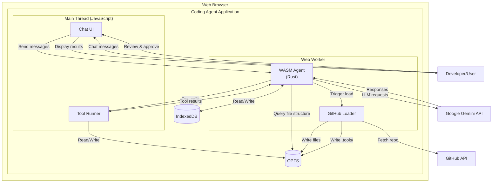
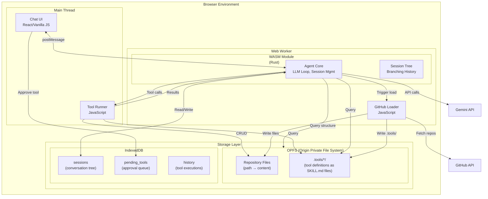
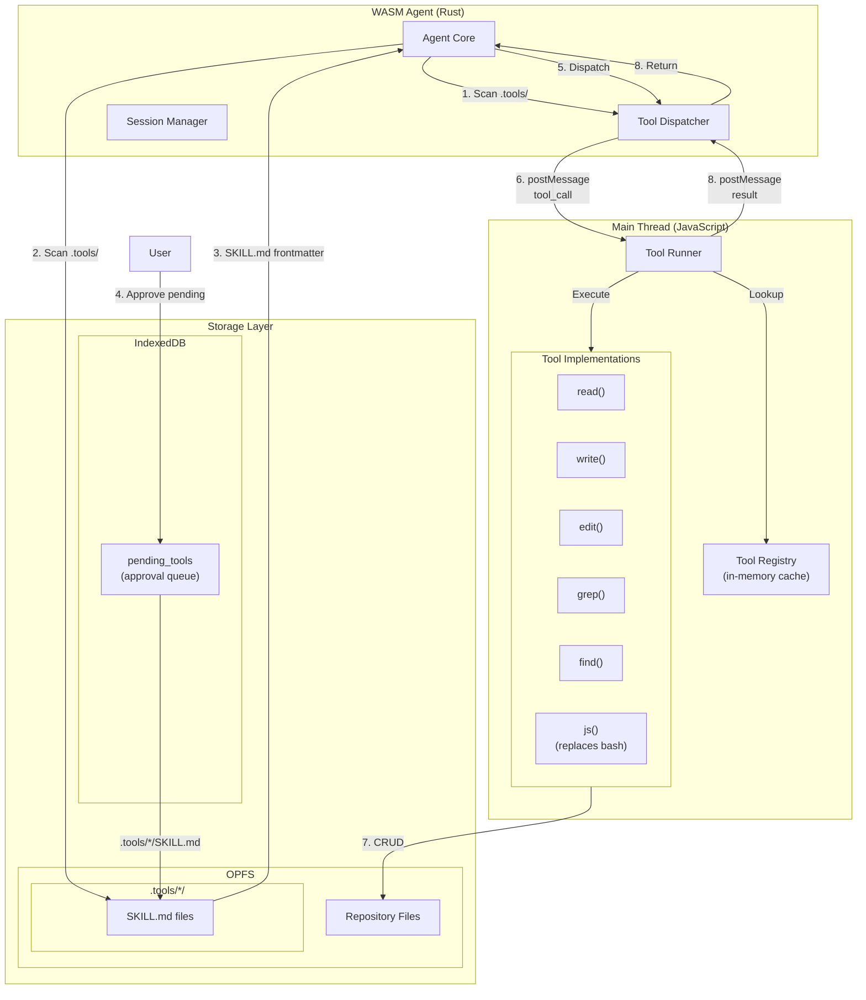
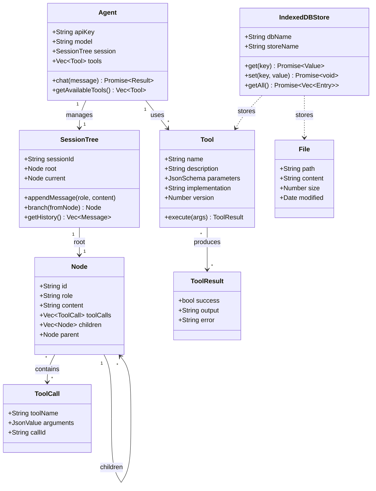
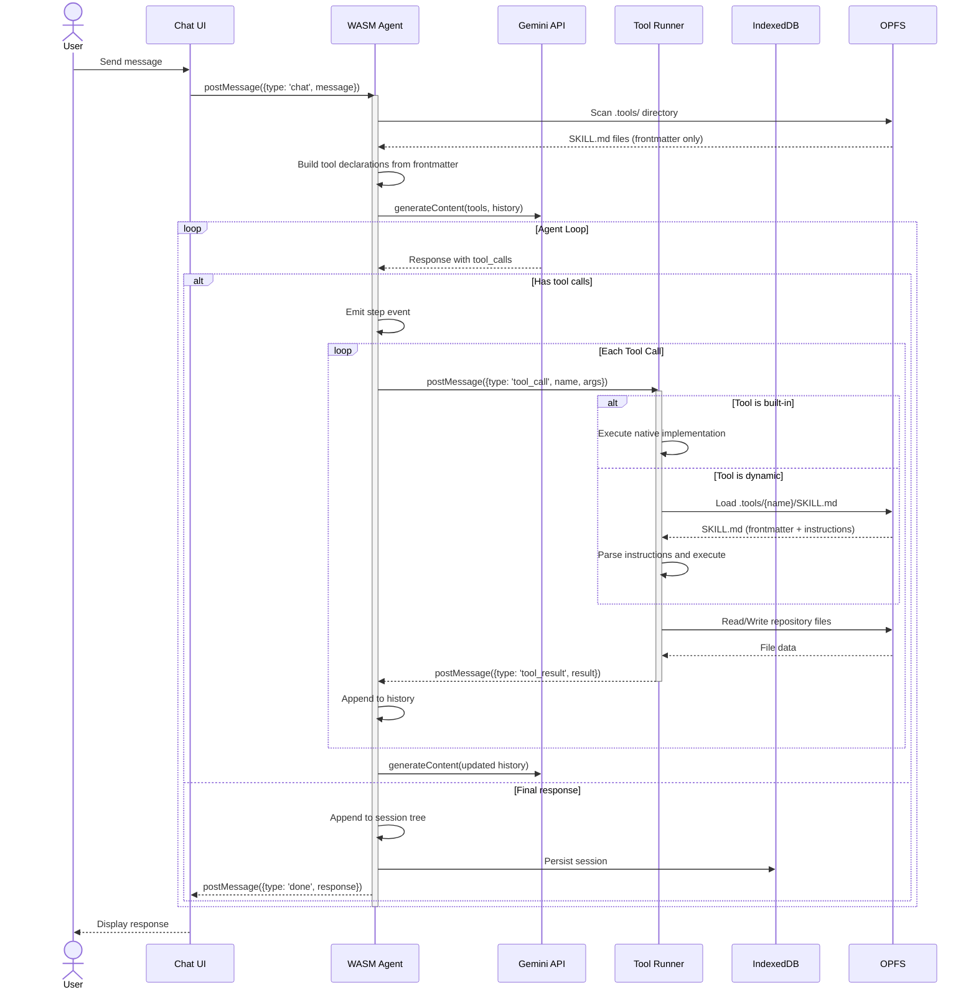
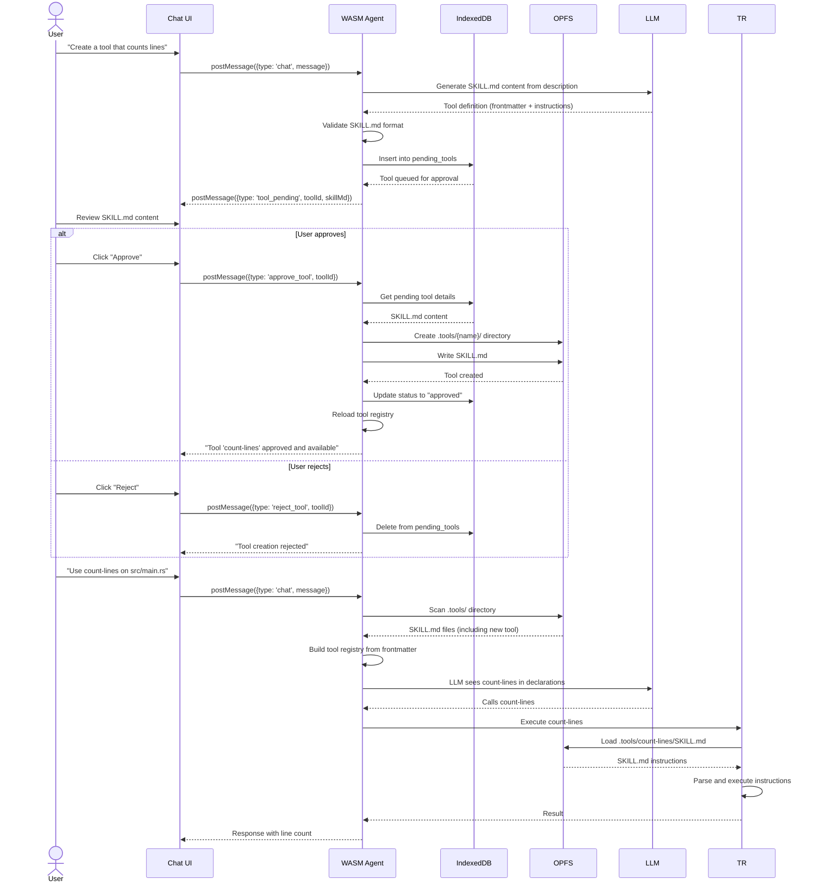
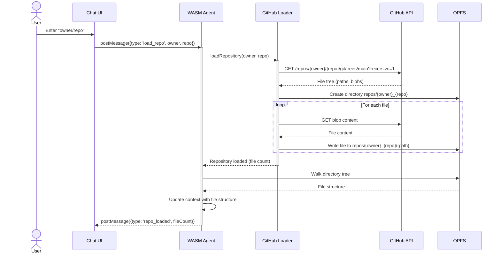
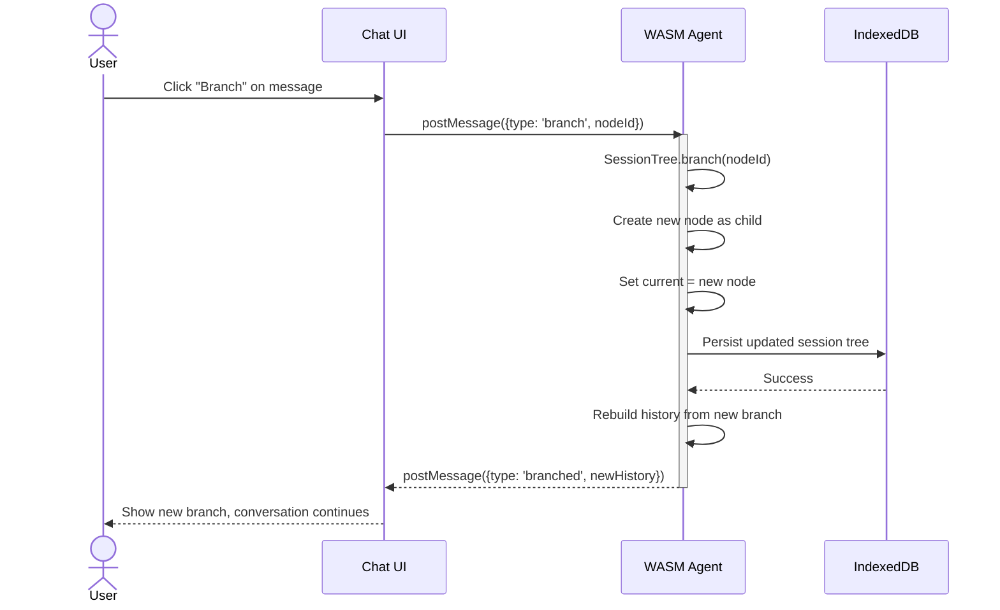

# Architecture: Browser Coding Agent

## Overview

A browser-based coding agent that combines LLM capabilities with a JavaScript tool execution environment. Uses a hybrid storage approach: OPFS (Origin Private File System) for file storage and IndexedDB for sessions, tools, and metadata. The agent runs in a Web Worker (WASM/Rust) while tools execute dynamically in the main thread via JavaScript.

**Storage Strategy:**
- **OPFS**: Repository files, tool definitions (large, hierarchical data, editable as files)
- **IndexedDB**: Session tree, tool execution history, pending tool approvals (structured, queryable data)

## Context

The agent enables developers to:
- Load GitHub repositories into a local OPFS-backed filesystem
- Chat with an AI assistant that can read, write, and edit files
- Create custom JavaScript tools dynamically
- Maintain branching conversation histories

## Design Philosophy

- **Simplicity over complexity**: No virtual shell, no file explorer UI
- **Dynamic extensibility**: Tools are stored as SKILL.md files in OPFS (`.tools/*/SKILL.md`), not hardcoded
- **Security first**: Dynamic tools require user approval before execution
- **Web-native**: Leverages browser capabilities (OPFS, IndexedDB, Web Workers, fetch)
- **Hot-reloadable**: New tools become available immediately after approval
- **Transparent**: Users can read and edit tool definitions as regular files

---

## System Context



---

## Container Architecture



### Container Responsibilities

| Container | Technology | Responsibility |
|-----------|-----------|----------------|
| Chat UI | JavaScript | User interface for chat, displays messages, tool approval UI |
| Tool Runner | JavaScript | Executes tools (read, write, edit, grep, find, js), operates on OPFS |
| GitHub Loader | JavaScript (Web Worker) | Fetches repositories from GitHub API, writes files and tools to OPFS |
| WASM Agent | Rust/WASM (Web Worker) | LLM chat loop, session management, tool dispatch, file structure queries |
| Session Tree | Rust | Branching conversation history, node management |
| Compaction Engine | Rust | Automatic context window management via message summarization |
| Export Manager | Rust | Session export to JSONL and Markdown formats |
| OPFS | Browser API | File storage for repository contents and tool definitions (`.tools/` directory) |
| IndexedDB | Browser API | Session tree, pending tool approvals, execution history |

---

## Component Details

### Tool System Architecture



### Component Descriptions

#### Agent Core (Rust)
- Manages the LLM conversation loop
- Maintains session tree state
- Discovers tools by scanning OPFS `.tools/` directory at startup
- Queries OPFS for file structure to provide context to LLM
- Dispatches tool calls to JavaScript via postMessage
- Receives tool results and feeds back to LLM

#### Tool Dispatcher (Rust)
- Scans OPFS `.tools/` directory to discover available tools
- Parses SKILL.md files to extract frontmatter (name, description, allowed-tools)
- Loads full instructions from SKILL.md markdown content when tool is invoked
- Converts tool definitions to Gemini function declarations
- Routes incoming tool calls from LLM to appropriate handler
- Validates tool results before adding to history

#### Tool Runner (JavaScript)
- Receives tool calls from WASM via postMessage
- Looks up tool implementation (built-in or dynamic)
- Executes tool with provided arguments
- Returns result to WASM

#### Built-in Tools
All tools operate directly on OPFS:

| Tool | Purpose | OPFS Operations |
|------|---------|---------------------|
| `read` | Read file contents with line numbers | getFileHandle → read |
| `write` | Write/create files | getFileHandle → createWritable → write |
| `edit` | Surgical find-and-replace | read → modify → write |
| `ls` | List directory contents | Read directory entries |
| `grep` | Search file contents | Walk directory → read each |
| `find` | Discover files by pattern | Walk directory → filter paths |
| `js` | Execute JavaScript | Arbitrary (via user code) |

#### Session Manager (Rust)
- Manages branching conversation tree
- Persists session changes to IndexedDB via callbacks
- Rebuilds conversation history for LLM from current branch

---

## Data Model



### Storage Schema

#### OPFS Structure
Repository files and tool definitions are stored in OPFS using a directory structure:
```
OPFS Root
└── repos/
    └── {owner}_{repo}/              // Repository root
        ├── src/
        │   └── main.rs              // File content
        ├── Cargo.toml
        ├── .tools/                  // Tool definitions directory
        │   ├── count_lines.json     // Tool: count lines in a file
        │   ├── find_unused.json     // Tool: find unused code
        │   └── custom_analyzer.json // User-created tool
        └── ...
```

**File Operations:**
- **Read**: `root.getFileHandle(path).getFile().text()`
- **Write**: `root.getFileHandle(path, {create: true}).createWritable().write(content)`
- **Directory traversal**: Use `FileSystemDirectoryHandle` to walk the tree

#### Tool Definition Format (OPFS)

Tools are defined using the SKILL.md format inspired by Claude's Agent Skills system. Each tool is a directory containing SKILL.md with YAML frontmatter and markdown instructions.

```
OPFS Root
└── repos/
    └── {owner}_{repo}/              // Repository root
        ├── src/
        │   └── main.rs              // File content
        ├── .tools/                  // Tools directory
        │   ├── count-lines/         // Tool directory
        │   │   ├── SKILL.md         // Tool definition (frontmatter + instructions)
        │   │   └── scripts/         // Optional bundled scripts
        │   │       └── count.js
        │   └── find-unused/         // Another tool
        │       └── SKILL.md
        └── ...
```

**SKILL.md Structure:**

```markdown
---
name: count-lines
description: Count lines in a file
allowed-tools: "Read, Write"
version: 1.0.0
---

# Count Lines Tool

## Purpose
Count the number of lines in a specified file.

## Usage
Call with a file path to get the line count.

## Instructions

1. Read the file at the specified path
2. Split content by newlines
3. Return the count

## Example

Input: `{ "path": "src/main.rs" }`
Output: `42`
```

**Frontmatter Fields:**

| Field | Required | Description |
|-------|----------|-------------|
| `name` | Yes | Tool identifier (used as command) |
| `description` | Yes | Brief description for LLM matching |
| `allowed-tools` | No | Comma-separated list of tools this tool can use |
| `version` | No | Tool version (e.g., "1.0.0") |

**Benefits of SKILL.md format:**
- **Readable**: Users can `read .tools/count-lines/SKILL.md` to inspect tool
- **Editable**: Users can modify tools using `edit` or `write` tools
- **Versionable**: Tool files can be tracked alongside repository code
- **Rich Documentation**: Markdown allows detailed instructions and examples
- **Progressive Disclosure**: Frontmatter for discovery, SKILL.md for details
- **Secure**: Users must explicitly approve dynamically created tools before execution

#### IndexedDB Schema

Tools are stored as files in OPFS (`.tools/*.json`). IndexedDB is used for sessions, history, and pending tool approvals:

#### `pending_tools` Store
```javascript
{
  toolId: "uuid-789",           // Primary key
  name: "custom_analyzer",
  description: "Custom code analyzer",
  parameters: { ... },
  implementation: "...",
  created: "2026-02-07T10:30:00Z",
  status: "pending",            // "pending", "approved", "rejected"
  requestedBy: "llm",           // "llm" or "user"
  reason: "User requested custom analysis"
}
```

**Tool Approval Workflow:**
1. LLM generates new tool → stored in `pending_tools` with status "pending"
2. UI displays SKILL.md to user for review
3. User approves → tool directory created at `.tools/{name}/` with SKILL.md written
4. User rejects → tool removed from `pending_tools`
5. Approved tools are immediately available for use

#### `sessions` Store
```javascript
{
  sessionId: "uuid-123",     // Primary key
  root: {
    id: "node-1",
    role: "user",
    content: "Hello",
    children: [...],
    parent: null
  },
  currentNodeId: "node-5",
  created: "2026-02-07T10:00:00Z",
  modified: "2026-02-07T10:30:00Z"
}
```

#### `history` Store
```javascript
{
  id: "uuid-456",           // Primary key
  sessionId: "uuid-123",
  timestamp: "2026-02-07T10:30:00Z",
  toolName: "read",
  arguments: { path: "src/main.rs" },
  result: { success: true, output: "fn main() {...}" }
}
```

---

## Sequence Diagrams

### Standard Tool Execution Flow



### Dynamic Tool Creation Flow (with Approval)



### GitHub Repository Loading



### Session Branching



---

## Tool Execution Details

### Built-in Tools

All built-in tools are implemented in JavaScript and operate directly on IndexedDB.

#### `read` Tool
```javascript
{
  name: "read",
  description: "Read file contents with optional line offset and limit",
  parameters: {
    type: "object",
    properties: {
      path: { type: "string", description: "File path to read" },
      offset: { type: "number", description: "1-indexed line number to start from" },
      limit: { type: "number", description: "Maximum lines to read" }
    },
    required: ["path"]
  }
}
// Implementation: OPFS getFileHandle(path).getFile().text(), return content with line numbers
```

#### `write` Tool
```javascript
{
  name: "write",
  description: "Write or overwrite a file",
  parameters: {
    type: "object",
    properties: {
      path: { type: "string", description: "File path" },
      content: { type: "string", description: "File content" }
    },
    required: ["path", "content"]
  }
}
// Implementation: OPFS getFileHandle(path, {create: true}).createWritable().write(content)
```

#### `edit` Tool
```javascript
{
  name: "edit",
  description: "Edit a file with surgical find-and-replace",
  parameters: {
    type: "object",
    properties: {
      path: { type: "string", description: "File path" },
      oldText: { type: "string", description: "Text to find" },
      newText: { type: "string", description: "Replacement text" }
    },
    required: ["path", "oldText", "newText"]
  }
}
// Implementation: OPFS read → find (with fuzzy matching) → replace → OPFS write
```

#### `ls` Tool
```javascript
{
  name: "ls",
  description: "List directory contents",
  parameters: {
    type: "object",
    properties: {
      path: { type: "string", description: "Directory path to list" },
      detailed: { type: "boolean", description: "Show detailed listing with permissions" }
    },
    required: ["path"]
  }
}
// Implementation: OPFS get directory handle → iterate entries → format output
// Returns: "drwxr-xr-x  src/\n-rw-r--r--  Cargo.toml\n..."
```

#### `grep` Tool
```javascript
{
  name: "grep",
  description: "Search file contents with regex pattern",
  parameters: {
    type: "object",
    properties: {
      pattern: { type: "string", description: "Regex pattern" },
      path: { type: "string", description: "Optional path to limit search" },
      ignoreCase: { type: "boolean" }
    },
    required: ["pattern"]
  }
}
// Implementation: OPFS walk directory (or path subtree) → read each file → match pattern
```

#### `find` Tool
```javascript
{
  name: "find",
  description: "Find files by glob pattern",
  parameters: {
    type: "object",
    properties: {
      pattern: { type: "string", description: "Glob pattern like '*.rs'" },
      path: { type: "string", description: "Optional starting directory" }
    },
    required: ["pattern"]
  }
}
// Implementation: OPFS walk directory → collect paths → filter by pattern
```

#### `js` Tool (Replaces bash)
```javascript
{
  name: "js",
  description: "Execute JavaScript code with access to file operations",
  parameters: {
    type: "object",
    properties: {
      code: { 
        type: "string", 
        description: "JavaScript code to execute. Available globals: read(path), write(path, content), grep(pattern), find(pattern), console" 
      }
    },
    required: ["code"]
  }
}
// Implementation: new Function('read', 'write', 'grep', 'find', 'console', code)(...builtins)
```

### Dynamic Tool API

Dynamic tools have access to:
- `read(path)` - Read file from OPFS
- `write(path, content)` - Write file to OPFS
- `grep(pattern, path?)` - Search file contents
- `find(pattern)` - Find files by pattern
- `console` - Console logging (captured and returned)

Tool code is wrapped:
```javascript
const toolFunction = new Function(
  'read', 'write', 'grep', 'find', 'console',
  tool.implementation
);
return toolFunction(read, write, grep, find, console);
```

---

## Session Management Features

### Context Compaction (Automatic)

**Purpose**: Prevent context window overflow by automatically summarizing older conversation history while preserving the full session tree.

**Location**: Agent Core (Rust)

**Trigger Conditions**:
- **Proactive**: Token count approaches model limit (configurable threshold, default 80%)
- **Reactive**: API returns context overflow error

**Compaction Algorithm**:
1. Keep N most recent messages intact (configurable, default 10)
2. Summarize older messages into compact representation:
   - User messages: Summarize intent and key points
   - Assistant messages: Summarize actions taken and results
   - Tool calls/results: Summarize what was done, not full output
3. Insert summary message before the preserved recent messages
4. Continue conversation with compressed context
5. Full history remains in session tree (accessible via `/tree`)

**Token Counting**:
- Track approximate token usage per message
- Include system prompt, tools, and conversation history
- Update count after each LLM response

**Configuration** (in IndexedDB settings store):
```javascript
{
  compaction: {
    enabled: true,
    proactiveThreshold: 0.8,        // Trigger at 80% of context limit
    preserveRecentMessages: 10,     // Keep last N messages uncompressed
    autoCompact: true,              // Automatic vs manual only
    modelLimits: {
      "gemini-1.5-pro": 128000,    // Context window size per model
      "gemini-1.5-flash": 128000
    }
  }
}
```

**Compaction Message Format**:
```
[Earlier conversation summarized]

The user initialized a session to work on a Rust project. Key actions included:
- Loading repository from GitHub
- Reading src/main.rs to understand structure  
- Creating a new utility module
- Running tests with cargo test

[Summary ends - see /tree for full history]
```

### Session Export

**Purpose**: Export session history to external formats for sharing, archiving, or analysis.

**Location**: UI command `/export` triggers Agent Core

**Export Formats**:

#### JSONL Format (Default)
Each line is a JSON object representing one session entry:
```jsonl
{"type": "user", "content": "Help me refactor", "timestamp": "2026-02-07T10:00:00Z"}
{"type": "assistant", "content": "I'll analyze the code", "timestamp": "2026-02-07T10:00:01Z"}
{"type": "tool_call", "name": "read", "args": {"path": "src/main.rs"}, "timestamp": "2026-02-07T10:00:02Z"}
{"type": "tool_result", "name": "read", "output": "...", "timestamp": "2026-02-07T10:00:03Z"}
```

#### Markdown Format
Human-readable conversation log:
```markdown
# Session Export - 2026-02-07

## User
Help me refactor

## Assistant
I'll analyze the code

## Tool: read
**Args**: `{"path": "src/main.rs"}`

**Output**:
```
fn main() {
    println!("Hello");
}
```

## Assistant
Here's my refactoring suggestion...
```

**Implementation**:
```javascript
// Triggered by UI command
async function exportSession(sessionId, format = 'jsonl') {
  const session = await db.sessions.get(sessionId);
  const history = buildHistoryFromTree(session.root);
  
  if (format === 'jsonl') {
    const jsonl = history.map(entry => JSON.stringify(entry)).join('\n');
    downloadFile(`session-${sessionId}.jsonl`, jsonl);
  } else if (format === 'md') {
    const markdown = convertToMarkdown(history);
    downloadFile(`session-${sessionId}.md`, markdown);
  }
}
```

**Export Contents**:
- Full conversation tree with all branches
- Tool calls and results
- Timestamps
- Session metadata (start time, total messages, cost if tracked)
- Does NOT include: full file contents (references paths only)

**User Interface**:
- Command: `/export [format]` where format is `jsonl` (default) or `md`
- Menu option: "Export Session" with format selector
- Download: Browser initiates file download

### OPFS Helper Functions

```javascript
// OPFS operations for tools
async function readFile(path) {
  const root = await navigator.storage.getDirectory();
  const handle = await root.getFileHandle(path);
  const file = await handle.getFile();
  return await file.text();
}

async function writeFile(path, content) {
  const root = await navigator.storage.getDirectory();
  
  // Create parent directories
  const parts = path.split('/');
  let dir = root;
  for (const part of parts.slice(0, -1)) {
    dir = await dir.getDirectoryHandle(part, { create: true });
  }
  
  const handle = await dir.getFileHandle(parts[parts.length - 1], { create: true });
  const writable = await handle.createWritable();
  await writable.write(content);
  await writable.close();
}

async function walkDirectory(dirHandle, path = '') {
  const files = [];
  for await (const [name, handle] of dirHandle.entries()) {
    const fullPath = path ? `${path}/${name}` : name;
    if (handle.kind === 'directory') {
      files.push(...await walkDirectory(handle, fullPath));
    } else {
      files.push(fullPath);
    }
  }
  return files;
}
```

---

## Communication Protocol

### Main Thread → Worker (WASM)

| Type | Payload | Description |
|------|---------|-------------|
| `init` | `{ apiKey, model, repo }` | Initialize agent |
| `chat` | `{ message }` | Send user message |
| `branch` | `{ nodeId }` | Branch session at node |
| `load_repo` | `{ owner, repo }` | Trigger GitHub load |
| `get_history` | `{}` | Request current branch history |
| `get_tree` | `{}` | Request full session tree |
| `approve_tool` | `{ toolId }` | Approve pending tool |
| `reject_tool` | `{ toolId }` | Reject pending tool |

### Worker (WASM) → Main Thread

| Type | Payload | Description |
|------|---------|-------------|
| `ready` | `{}` | Agent initialized |
| `step` | `{ type, content, toolCalls? }` | Agent step event |
| `tool_call` | `{ callId, name, arguments }` | Execute tool |
| `tool_result` | `{ callId, result }` | Tool result (from JS) |
| `done` | `{ response }` | Final response |
| `error` | `{ message }` | Error occurred |
| `tool_pending` | `{ toolId, name, code }` | New tool awaiting approval |

### Main Thread → Tool Runner

The Tool Runner is part of the Main Thread but logically separate. Communication is direct function calls, not messages.

---

## Security Considerations

1. **Dynamic Code Execution**: The `js` tool and dynamic tools use `new Function()`, which runs in the same context as the Tool Runner. This is acceptable because:
   - Code is generated by the LLM, not arbitrary user input
   - No access to `window`, `document`, or other browser globals (only injected `read`, `write`, etc.)
   - Runs in the main thread (can be moved to a separate worker later if needed)

2. **Tool Approval**: Dynamically created tools require explicit user approval before execution:
   - Tools are stored in `pending_tools` queue initially
   - User must review and approve code before it becomes available
   - Approved tools are written to OPFS `.tools/{name}.json`
   - Prevents LLM from executing arbitrary code without oversight

3. **Storage Isolation**:
   - **OPFS**: Each repository gets its own directory (`repos/{owner}_{repo}/`) to avoid conflicts
   - **IndexedDB**: Sessions, history, and pending tools are namespaced by agent instance

3. **API Keys**: Stored in WASM memory, never persisted to storage. Passed from UI at initialization.

---

## Future Enhancements

1. **Tool Worker**: Move tool execution to a dedicated Web Worker to prevent blocking the main thread during long operations
2. **Tool Versioning**: Track tool versions and allow rollback to previous implementations
3. **Tool Marketplace**: Import tools from URLs or a shared registry
4. **Streaming**: Add streaming LLM responses for better UX
5. **File Explorer**: Optional UI component for visual file browsing
6. **Multi-repo**: Support loading multiple repositories simultaneously

---

## Implementation Notes

### WASM-JavaScript Bridge

Tools are the primary bridge between WASM and JavaScript:
```rust
// Rust side
#[wasm_bindgen]
extern "C" {
    #[wasm_bindgen(js_name = "executeTool")]
    fn execute_tool(name: &str, args: &str) -> js_sys::Promise;
}
```

```javascript
// JavaScript side
globalThis.executeTool = async (name, argsJson) => {
  const args = JSON.parse(argsJson);
  // Load tool from OPFS .tools/ directory
  const skillMd = await readFile(`.tools/${name}/SKILL.md`);
  const { frontmatter, content } = parseSkillMd(skillMd);
  const result = await executeSkillInstructions(frontmatter, content, args);
  return JSON.stringify(result);
};

globalThis.scanTools = async () => {
  // Scan .tools/ directory in OPFS for SKILL.md files
  const root = await navigator.storage.getDirectory();
  const toolsDir = await root.getDirectoryHandle('.tools', { create: true });
  const tools = [];
  
  for await (const [name, handle] of toolsDir.entries()) {
    if (handle.kind === 'directory') {
      try {
        const skillFile = await handle.getFileHandle('SKILL.md');
        const file = await skillFile.getFile();
        const content = await file.text();
        const { frontmatter } = parseSkillMd(content);
        tools.push({
          name: frontmatter.name,
          description: frontmatter.description,
          allowedTools: frontmatter['allowed-tools']?.split(',').map(s => s.trim()) || []
        });
      } catch (e) {
        // No SKILL.md in this directory, skip
      }
    }
  }
  return JSON.stringify(tools);
};

// Parse SKILL.md frontmatter and content
function parseSkillMd(content) {
  const frontmatterMatch = content.match(/^---\n([\s\S]*?)\n---\n([\s\S]*)$/);
  if (!frontmatterMatch) {
    throw new Error('Invalid SKILL.md format: missing frontmatter');
  }
  
  const frontmatter = parseYaml(frontmatterMatch[1]);
  const markdownContent = frontmatterMatch[2].trim();
  
  return { frontmatter, content: markdownContent };
}
```

### OPFS in Web Workers

OPFS is accessible from Web Workers using `navigator.storage.getDirectory()`:

```javascript
// In Web Worker (GitHub Loader)
async function writeRepoFile(repoPath, filePath, content) {
  const root = await navigator.storage.getDirectory();
  const repoDir = await root.getDirectoryHandle(repoPath, { create: true });
  
  // Create nested directories
  const parts = filePath.split('/');
  let current = repoDir;
  for (const part of parts.slice(0, -1)) {
    current = await current.getDirectoryHandle(part, { create: true });
  }
  
  // Write file
  const fileHandle = await current.getFileHandle(parts[parts.length - 1], { create: true });
  const writable = await fileHandle.createWritable();
  await writable.write(content);
  await writable.close();
}
```

**Note:** OPFS operations are async but can use `FileSystemSyncAccessHandle` in Web Workers for synchronous file I/O when needed.

### Error Handling

- **Tool errors**: Returned as failed `ToolResult`, shown to LLM
- **Network errors**: LLM API failures retry with backoff
- **Storage errors**: Critical, emit `error` event to UI

---

## Related Documentation

- Original Plan: `plans/09-integrated-agent.md`
- Agent Implementation: `06-agent/ARCHITECTURE.md`
- TypeScript Reference: `coding-agent/` directory
- Building Blocks: `01-hello-worker/` through `08-virtual-shell/`
