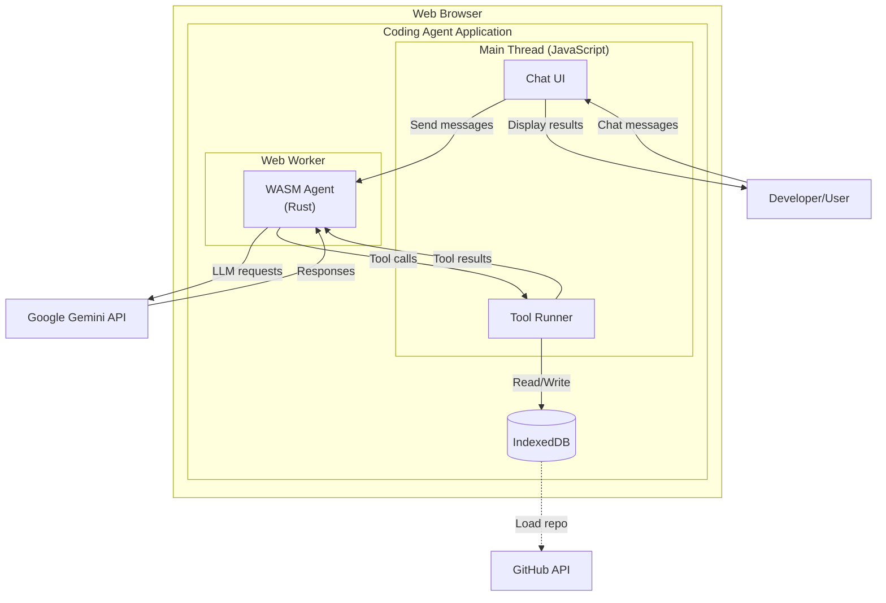
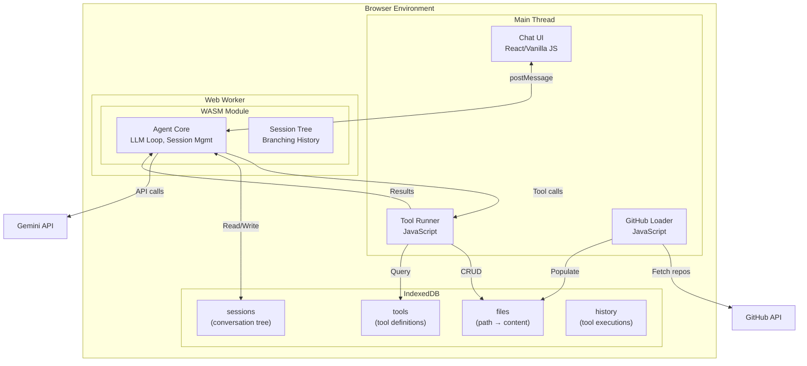
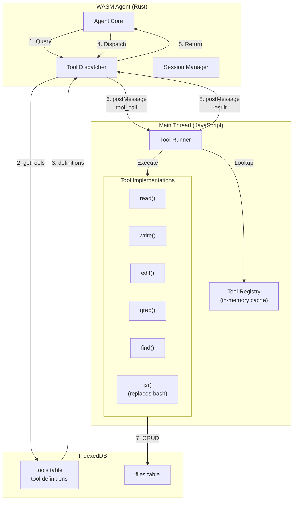
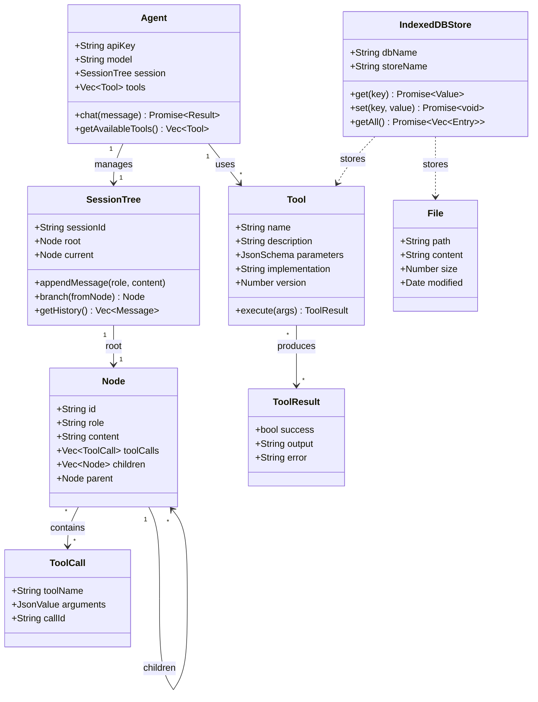
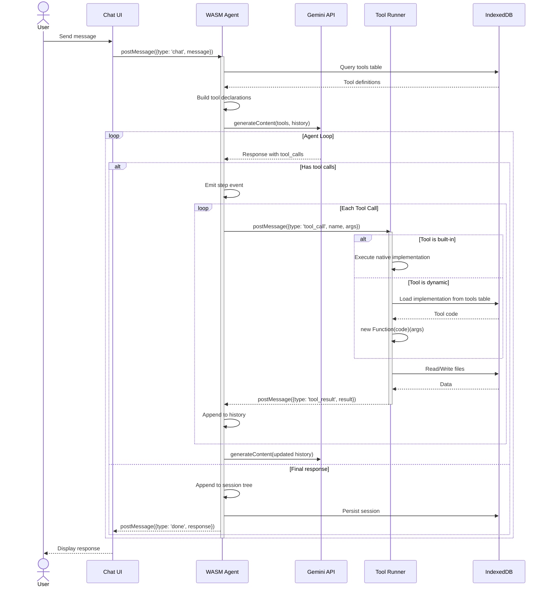
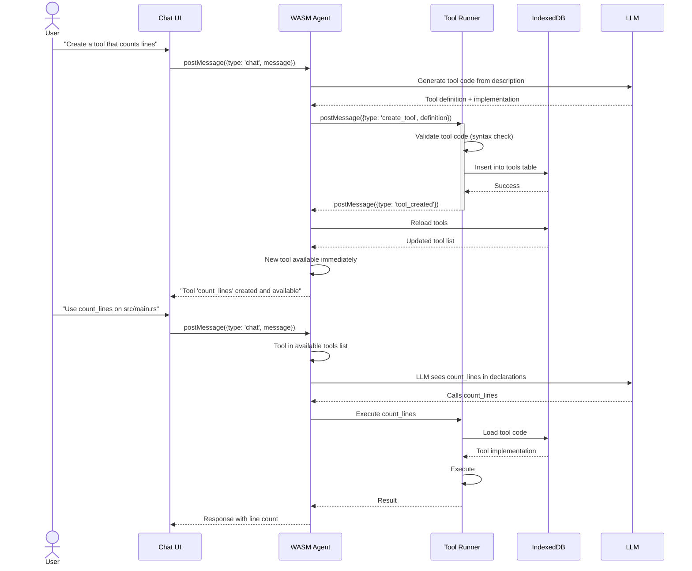
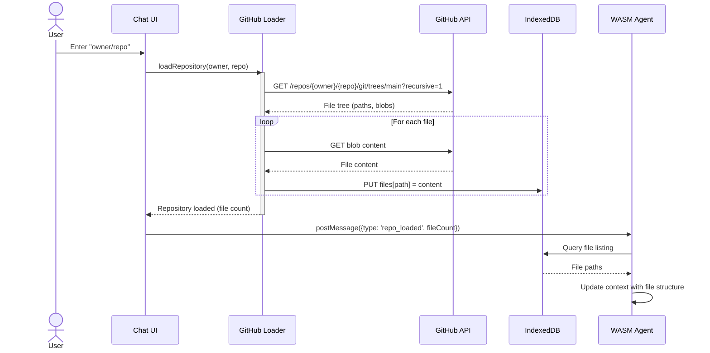
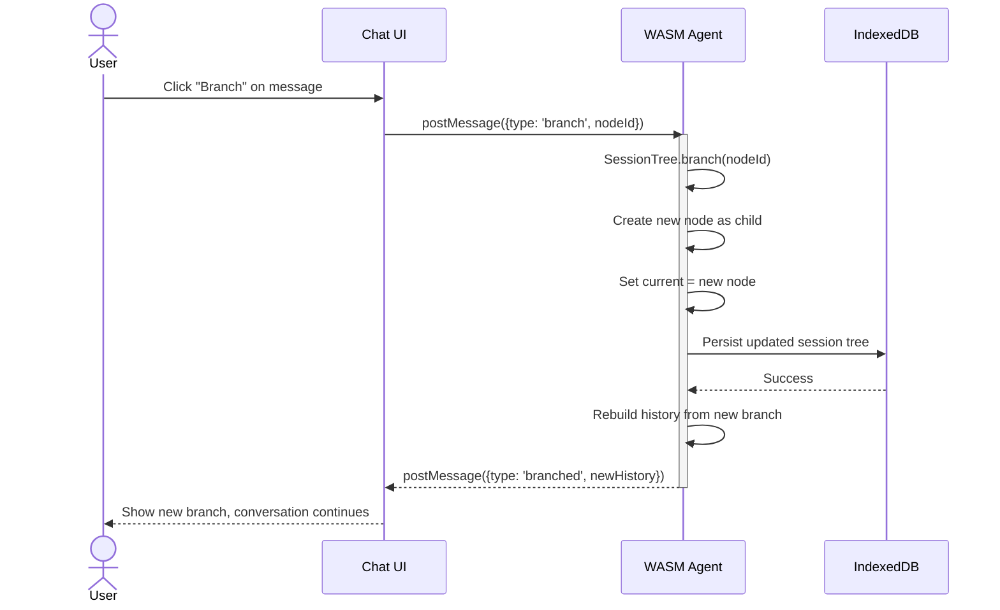

# Architecture: Browser Coding Agent

## Overview

A browser-based coding agent that combines LLM capabilities with a JavaScript tool execution environment, backed by IndexedDB storage. The agent runs in a Web Worker (WASM/Rust) while tools execute dynamically in the main thread via JavaScript.

## Context

The agent enables developers to:
- Load GitHub repositories into a local IndexedDB-backed filesystem
- Chat with an AI assistant that can read, write, and edit files
- Create custom JavaScript tools dynamically
- Maintain branching conversation histories

## Design Philosophy

- **Simplicity over complexity**: No virtual shell, no file explorer UI
- **Dynamic extensibility**: Tools are data stored in IndexedDB, not hardcoded
- **Web-native**: Leverages browser capabilities (IndexedDB, Web Workers, fetch)
- **Hot-reloadable**: New tools become available immediately without page refresh

---

## System Context



---

## Container Architecture



### Container Responsibilities

| Container | Technology | Responsibility |
|-----------|-----------|----------------|
| Chat UI | JavaScript | User interface for chat, displays messages and tool results |
| Tool Runner | JavaScript | Executes tools (read, write, edit, grep, find, js), operates on IndexedDB |
| GitHub Loader | JavaScript | Fetches repositories from GitHub API, populates files table |
| WASM Agent | Rust/WASM | LLM chat loop, session management, tool dispatch |
| Session Tree | Rust | Branching conversation history, node management |
| IndexedDB | Browser API | Persistent storage for files, sessions, tools, and history |

---

## Component Details

### Tool System Architecture



### Component Descriptions

#### Agent Core (Rust)
- Manages the LLM conversation loop
- Maintains session tree state
- Discovers tools from IndexedDB at startup
- Dispatches tool calls to JavaScript via postMessage
- Receives tool results and feeds back to LLM

#### Tool Dispatcher (Rust)
- Queries IndexedDB `tools` table to build tool registry
- Converts tool definitions to Gemini function declarations
- Routes incoming tool calls from LLM to appropriate handler
- Validates tool results before adding to history

#### Tool Runner (JavaScript)
- Receives tool calls from WASM via postMessage
- Looks up tool implementation (built-in or dynamic)
- Executes tool with provided arguments
- Returns result to WASM

#### Built-in Tools
All tools operate directly on IndexedDB:

| Tool | Purpose | IndexedDB Operations |
|------|---------|---------------------|
| `read` | Read file contents with line numbers | GET files[path] |
| `write` | Write/create files | PUT files[path] |
| `edit` | Surgical find-and-replace | GET → modify → PUT files[path] |
| `grep` | Search file contents | GET all → scan |
| `find` | Discover files by pattern | GET all keys → filter |
| `js` | Execute JavaScript | Arbitrary (via user code) |

#### Session Manager (Rust)
- Manages branching conversation tree
- Persists session changes to IndexedDB via callbacks
- Rebuilds conversation history for LLM from current branch

---

## Data Model



### IndexedDB Schema

#### `files` Store
```javascript
{
  path: "src/main.rs",      // Primary key
  content: "fn main() {...}",
  size: 1234,
  modified: "2026-02-07T10:30:00Z"
}
```

#### `tools` Store
```javascript
{
  name: "count_lines",       // Primary key
  description: "Count lines in a file",
  parameters: {
    type: "object",
    properties: {
      path: { type: "string" }
    },
    required: ["path"]
  },
  implementation: "(args) => { const content = read(args.path); return content.split('\\n').length; }",
  version: 1,
  created: "2026-02-07T10:30:00Z"
}
```

#### `sessions` Store
```javascript
{
  sessionId: "uuid-123",     // Primary key
  root: {
    id: "node-1",
    role: "user",
    content: "Hello",
    children: [...],
    parent: null
  },
  currentNodeId: "node-5",
  created: "2026-02-07T10:00:00Z",
  modified: "2026-02-07T10:30:00Z"
}
```

#### `history` Store
```javascript
{
  id: "uuid-456",           // Primary key
  sessionId: "uuid-123",
  timestamp: "2026-02-07T10:30:00Z",
  toolName: "read",
  arguments: { path: "src/main.rs" },
  result: { success: true, output: "fn main() {...}" }
}
```

---

## Sequence Diagrams

### Standard Tool Execution Flow



### Dynamic Tool Creation Flow



### GitHub Repository Loading



### Session Branching



---

## Tool Execution Details

### Built-in Tools

All built-in tools are implemented in JavaScript and operate directly on IndexedDB.

#### `read` Tool
```javascript
{
  name: "read",
  description: "Read file contents with optional line offset and limit",
  parameters: {
    type: "object",
    properties: {
      path: { type: "string", description: "File path to read" },
      offset: { type: "number", description: "1-indexed line number to start from" },
      limit: { type: "number", description: "Maximum lines to read" }
    },
    required: ["path"]
  }
}
// Implementation: Query IndexedDB files store, return content with line numbers
```

#### `write` Tool
```javascript
{
  name: "write",
  description: "Write or overwrite a file",
  parameters: {
    type: "object",
    properties: {
      path: { type: "string", description: "File path" },
      content: { type: "string", description: "File content" }
    },
    required: ["path", "content"]
  }
}
// Implementation: PUT to IndexedDB files store
```

#### `edit` Tool
```javascript
{
  name: "edit",
  description: "Edit a file with surgical find-and-replace",
  parameters: {
    type: "object",
    properties: {
      path: { type: "string", description: "File path" },
      oldText: { type: "string", description: "Text to find" },
      newText: { type: "string", description: "Replacement text" }
    },
    required: ["path", "oldText", "newText"]
  }
}
// Implementation: GET → find (with fuzzy matching) → replace → PUT
```

#### `grep` Tool
```javascript
{
  name: "grep",
  description: "Search file contents with regex pattern",
  parameters: {
    type: "object",
    properties: {
      pattern: { type: "string", description: "Regex pattern" },
      path: { type: "string", description: "Optional path to limit search" },
      ignoreCase: { type: "boolean" }
    },
    required: ["pattern"]
  }
}
// Implementation: Scan all files (or path subtree), return matches with line numbers
```

#### `find` Tool
```javascript
{
  name: "find",
  description: "Find files by glob pattern",
  parameters: {
    type: "object",
    properties: {
      pattern: { type: "string", description: "Glob pattern like '*.rs'" },
      path: { type: "string", description: "Optional starting directory" }
    },
    required: ["pattern"]
  }
}
// Implementation: Query all file paths, filter by pattern
```

#### `js` Tool (Replaces bash)
```javascript
{
  name: "js",
  description: "Execute JavaScript code with access to file operations",
  parameters: {
    type: "object",
    properties: {
      code: { 
        type: "string", 
        description: "JavaScript code to execute. Available globals: read(path), write(path, content), grep(pattern), find(pattern), console" 
      }
    },
    required: ["code"]
  }
}
// Implementation: new Function('read', 'write', 'grep', 'find', 'console', code)(...builtins)
```

### Dynamic Tool API

Dynamic tools have access to:
- `read(path)` - Read file from IndexedDB
- `write(path, content)` - Write file to IndexedDB
- `grep(pattern, path?)` - Search file contents
- `find(pattern)` - Find files by pattern
- `console` - Console logging (captured and returned)

Tool code is wrapped:
```javascript
const toolFunction = new Function(
  'read', 'write', 'grep', 'find', 'console',
  tool.implementation
);
return toolFunction(read, write, grep, find, console);
```

---

## Communication Protocol

### Main Thread → Worker (WASM)

| Type | Payload | Description |
|------|---------|-------------|
| `init` | `{ apiKey, model, repo }` | Initialize agent |
| `chat` | `{ message }` | Send user message |
| `branch` | `{ nodeId }` | Branch session at node |
| `load_repo` | `{ owner, repo }` | Trigger GitHub load |
| `get_history` | `{}` | Request current branch history |
| `get_tree` | `{}` | Request full session tree |

### Worker (WASM) → Main Thread

| Type | Payload | Description |
|------|---------|-------------|
| `ready` | `{}` | Agent initialized |
| `step` | `{ type, content, toolCalls? }` | Agent step event |
| `tool_call` | `{ callId, name, arguments }` | Execute tool |
| `tool_result` | `{ callId, result }` | Tool result (from JS) |
| `done` | `{ response }` | Final response |
| `error` | `{ message }` | Error occurred |
| `create_tool` | `{ definition }` | Store new tool |

### Main Thread → Tool Runner

The Tool Runner is part of the Main Thread but logically separate. Communication is direct function calls, not messages.

---

## Security Considerations

1. **Dynamic Code Execution**: The `js` tool and dynamic tools use `new Function()`, which runs in the same context as the Tool Runner. This is acceptable because:
   - Code is generated by the LLM, not arbitrary user input
   - No access to `window`, `document`, or other browser globals (only injected `read`, `write`, etc.)
   - Runs in the main thread (can be moved to a separate worker later if needed)

2. **IndexedDB Isolation**: Each repository gets its own IndexedDB database or prefix to avoid conflicts.

3. **API Keys**: Stored in WASM memory, never persisted to storage. Passed from UI at initialization.

---

## Future Enhancements

1. **Tool Worker**: Move tool execution to a dedicated Web Worker to prevent blocking the main thread during long operations
2. **Tool Permissions**: Add permission levels (trusted/untrusted) for dynamic tools
3. **Tool Marketplace**: Import tools from URLs or a shared registry
4. **Streaming**: Add streaming LLM responses for better UX
5. **File Explorer**: Optional UI component for visual file browsing
6. **Multi-repo**: Support loading multiple repositories simultaneously

---

## Implementation Notes

### WASM-JavaScript Bridge

Tools are the primary bridge between WASM and JavaScript:
```rust
// Rust side
#[wasm_bindgen]
extern "C" {
    #[wasm_bindgen(js_name = "executeTool")]
    fn execute_tool(name: &str, args: &str) -> js_sys::Promise;
}
```

```javascript
// JavaScript side
globalThis.executeTool = async (name, argsJson) => {
  const args = JSON.parse(argsJson);
  const tool = await db.tools.get(name);
  const result = await executeToolImpl(tool, args);
  return JSON.stringify(result);
};
```

### IndexedDB Transactions

All tool operations use IndexedDB transactions for consistency:
```javascript
async function readFile(path) {
  const tx = db.transaction('files', 'readonly');
  const store = tx.objectStore('files');
  return await store.get(path);
}
```

### Error Handling

- **Tool errors**: Returned as failed `ToolResult`, shown to LLM
- **Network errors**: LLM API failures retry with backoff
- **Storage errors**: Critical, emit `error` event to UI

---

## Related Documentation

- Original Plan: `plans/09-integrated-agent.md`
- Agent Implementation: `06-agent/ARCHITECTURE.md`
- TypeScript Reference: `coding-agent/` directory
- Building Blocks: `01-hello-worker/` through `08-virtual-shell/`
